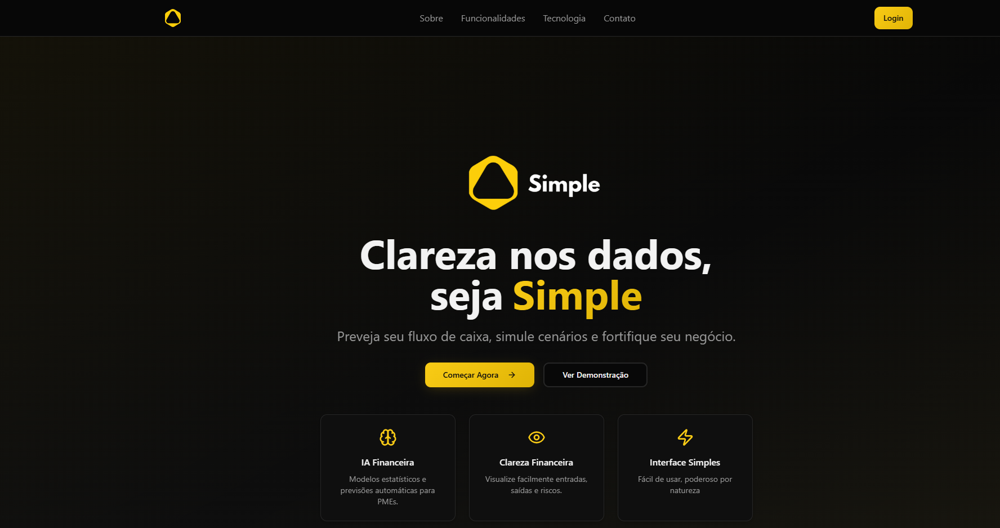

# Simple Tech — Frontend

[](https://matheusmaggiorini.github.io/simple-tech-app/)
[](https://simple-tech-api.onrender.com/health)

React dashboard for **Simple Tech**, a cloud financial management platform built by a student team. Upload cash-flow data, explore KPIs, run ML forecasts, Monte Carlo simulations, and generate executive reports.

**Live app:** https://matheusmaggiorini.github.io/simple-tech-app/  
**Backend repo:** https://github.com/matheusmaggiorini/simple-tech-api

---

## Demo flow (2 minutes)

1. Open the [live app](https://matheusmaggiorini.github.io/simple-tech-app/) → **Login** or create an account  
2. **Upload** CSV/Excel files (inflow and/or outflow in the same file)  
3. **Dashboard** — balance, monthly charts, recent transactions  
4. **Cash flow forecast** — ML prediction for the next N days  
5. **Scenario simulation** — macro, business events, or loan impact  
6. **Generate report** — formatted executive summary from your data  

> **Note:** Backend runs on Render Free tier. First request after idle may take ~30 seconds. Uploaded data may reset after redeploy (ephemeral disk).

---

## Screenshots

### Landing page



*Add `docs/screenshots/dashboard.png` after capturing your dashboard with sample data uploaded.*

---

## Features

| Module | Description |
|--------|-------------|
| **Auth** | JWT login/register, protected routes |
| **Upload** | Multi-file CSV/XLSX bundle, Brazilian currency formats |
| **Dashboard** | Global KPIs, balance evolution, monthly breakdown |
| **Forecast** | XGBoost-based cash flow prediction |
| **Simulation** | Monte Carlo, business events, loan scenarios |
| **Reports** | Markdown executive reports (auto-generated; optional Gemini AI) |

---

## Tech stack

React 18 · TypeScript · Vite · shadcn/ui · Tailwind CSS · TanStack Query · Recharts · Axios

Deployed on **GitHub Pages** (frontend) + **Render** (backend).

---

## Local setup

```powershell
git clone https://github.com/matheusmaggiorini/simple-tech-app.git
cd simple-tech-app
npm install
copy .env.example .env
npm run dev
```

App: http://localhost:8080

### Environment

```env
VITE_API_BASE_URL=http://localhost:8000
```

For production builds (GitHub Pages):

```env
GITHUB_PAGES=true
VITE_API_BASE_URL=https://simple-tech-api.onrender.com
```

---

## Routes

| Path | Description |
|------|-------------|
| `/` | Landing page |
| `/auth` | Login / sign up |
| `/dashboard` | Financial overview |
| `/dashboard/upload` | File upload |
| `/dashboard/previsao` | Cash flow forecast |
| `/dashboard/simulacao` | Scenario simulation |

---

## Scripts

| Command | Description |
|---------|-------------|
| `npm run dev` | Development server (port 8080) |
| `npm run build` | Production build |
| `npm run preview` | Preview production build |
| `npm run lint` | ESLint |

---

## CSV format (example)

```csv
data,descricao,entrada,saida,id_cliente
2025-01-09,Product sale,2449.50,0.00,C11
2025-01-05,Office rent,0.00,2115.00,ADM
```

---

## Team & role

**Simple Tech** — group project (Humber / FECAP background).  
**Matheus Maggiorini** — CTO: technical direction, API integration, deployment, auth, and full-stack maintenance.

---

## License

Team project. Contact the Simple Tech team for usage rights.
